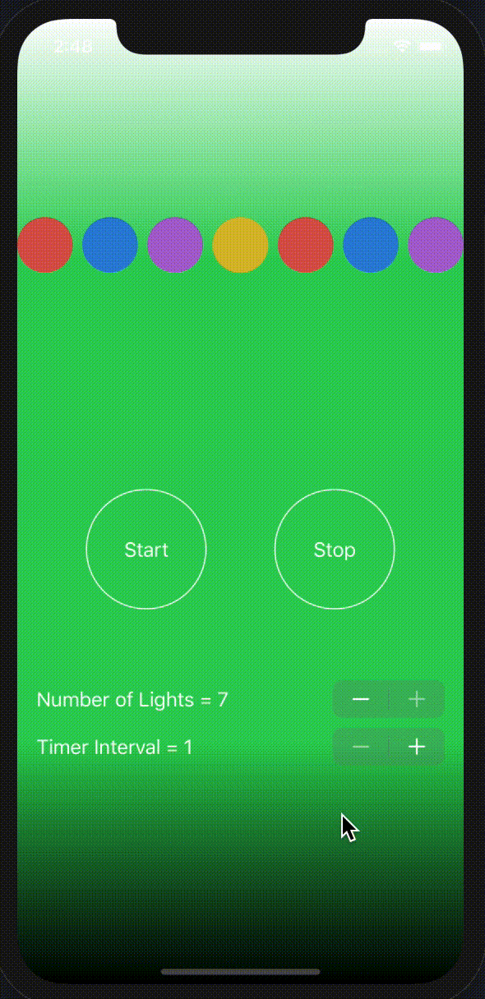

# 100Apps-04XmasLights

App 4 of my 100 App Challenge - https://github.com/Whoopinstick/100AppsChallenge

04 - Christmas Lights

Written in Swift / SwiftUI  
Uses ForEach and Stepper to select the number of lights  
Conditional View to toggle on/off state.  Made from Circle views with an overlay  
Uses Timer to trigger the state switch  
Timer interval also linked to a Stepper  

